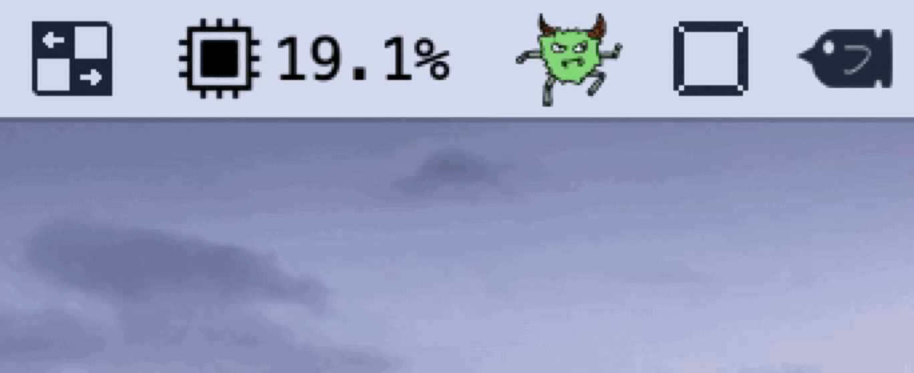

# RunUhooi

<!-- # Short Description -->

The Uhooi version of RunCat.
This app is licensed by Mr. Uhooi.

<!-- # Badges -->

# Tags

`The Uhooi` `Swift` `macOS`

# Demo

Have fun every day with the running Uhooi!!

# Installation

1. Download the dmg file from [Releases](https://github.com/Kyome22/RunUhooi/releases).
1. Install PreviewHelper.app.

# Contributors

- [Kyome22](https://github.com/Kyome22)

<!-- CREATED_BY_LEADYOU_README_GENERATOR -->